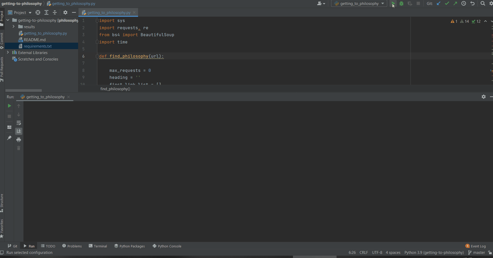
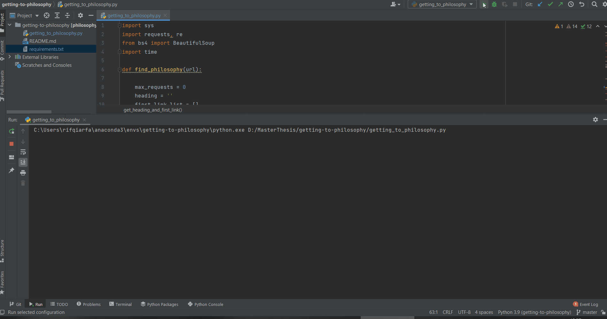

# Getting to Philosophy Wikipedia

## Table of contents
* [General Info](#general-info)
* [Introduction](#introduction)
* [Goals](#goals)
* [Technologies](#technologies)
* [Dependencies](#dependencies)
* [How To Use](#how-to-use)
* [Results](#results)

## General Info:
This project is for Python/DS Coding Task.

## Introduction:
Clicking on the first link in the main body of a Wikipedia article and repeating the process for subsequent articles would usually lead to the article Philosophy.

## Goals:
* The program should receive a Wikipedia link as an input, go to another normal link and repeat this process until either the Philosophy page is reached, or we are in an article without any outgoing wiki links or stuck in a loop.
* Use a 0.5-second timeout between queries to avoid heavy load on Wikipedia.
* Use https://en.wikipedia.org/wiki/Special:Random for testing.

## Technologies:
Project is created with:
* Python 3
* PyCharm

## Dependencies:
see requirements.txt

## How To Use:
* Clone this repository
* Create a new environment in PyCharm, install the packages from requirements.txt
* Open getting-to-philosophy.py
* Click Run (It is automatically run this link http://en.wikipedia.org/wiki/Special:Random)

## Results
### Get to Philosophy

### Get to Loop

